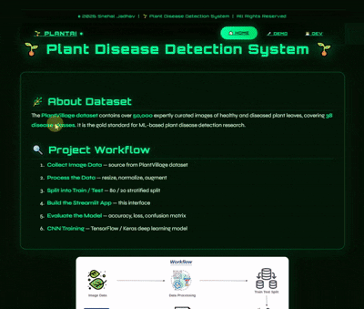

<div align="center">
  
  
  
  
  
  
  
  
  
  
  
  
  
  
  
  
  
  
  
  
  
  
  
</div>

<div align="center">
  
</div>


# 🌿 AI Plant Disease Detection System

An intelligent deep learning-based system that detects plant diseases from leaf images using Convolutional Neural Networks built with TensorFlow & Keras.

This project helps farmers, researchers, and agricultural experts detect crop diseases early and prevent yield loss.


## 🎥 Project Demo



## 🎥 Demo Preview

👉 [Click here to watch full screen demo](https://screenrec.com/share/vZUruQBYP4)


## 📊 Model Performance

| Metric | Validation | Test |
|--------|------------|------|
| 🎯 Accuracy | 94% | 92% |
| 📊 F1 Score | 0.93 | 0.91 |

---

# 📂 Dataset

Dataset Source: Kaggle PlantVillage Dataset

The dataset contains multiple plant leaf images categorized into:

- Healthy
- Early Blight
- Late Blight
- Leaf Mold
- Powdery Mildew
- Rust
- Bacterial Spot

---

## 📈 Data Augmentation

### Why Data Augmentation?

The original dataset had limited samples per class and class imbalance.

Data augmentation was used to:

- Increase dataset size
- Improve generalization
- Reduce overfitting
- Handle class imbalance

### Techniques Used:

- Rotation
- Horizontal & Vertical Flip
- Zoom
- Width/Height Shift
- Shear Transformation

Before augmentation:
- ~3000 images

After augmentation:
- ~12000+ images

---

## 🔍 Data Preprocessing

Each image goes through:

1. Leaf extraction / background noise reduction
2. Resize to (224, 224, 3)
3. Pixel normalization (0–1 scaling)
4. Label encoding

---

## 📊 Data Split

- 70% Training
- 15% Validation
- 15% Testing

---

# 🧠 Neural Network Architecture

The CNN architecture:

1. Conv2D (32 filters, 3x3)
2. ReLU Activation
3. MaxPooling
4. Conv2D (64 filters)
5. Batch Normalization
6. MaxPooling
7. Dropout
8. Flatten
9. Dense Layer
10. Softmax Output (Multi-class)

---

## Why This Architecture?

Initially, transfer learning was tested using:

- ResNet50
- VGG16

However, due to hardware limitations and overfitting on small dataset size, a custom lightweight CNN was designed.

This resulted in:

- Faster training
- Lower memory usage
- Better generalization
- Stable validation accuracy

---

# 🏋️ Training

- Optimizer: Adam
- Loss Function: Categorical Crossentropy
- Epochs: 25
- Batch Size: 32

Best validation accuracy achieved at epoch 21.

---

## 📉 Training Graphs


---

# 🧪 Final Results

The best model detects plant diseases with:

✅ 92% Accuracy on Test Set  
✅ 0.91 F1 Score  
✅ Balanced Precision & Recall  

---

# 🚀 How to Run

### Clone Repository

```bash
git clone https://github.com/YOUR_USERNAME/AI-Plant-Disease-Detection-System.git
cd AI-Plant-Disease-Detection-System


